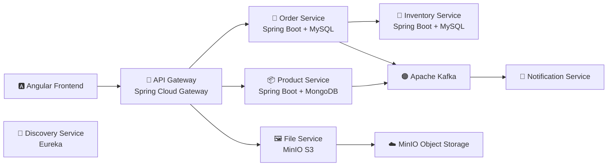
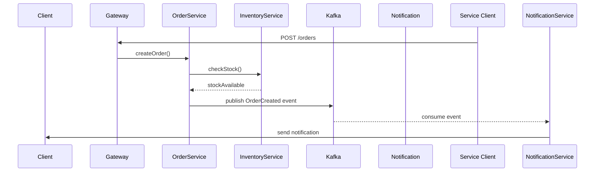
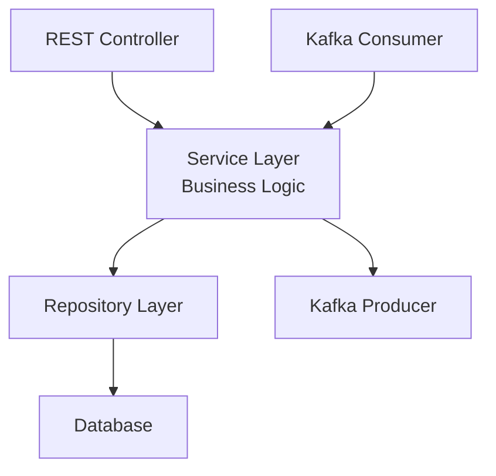

# 🧩 Microservice Grid 🧩     


----
**MicroserviceGrid** is a production-style **microservices platform** built with **Spring Boot 3 and Spring Cloud**.

The project demonstrates a modern distributed system including:

* reactive API gateway
* service discovery
* event-driven architecture
* centralized authentication
* observability stack
* containerized infrastructure

The system simulates a real-world e-commerce platform composed of multiple independent microservices.

---

## ⚙️ Tech Stack
### Backend
* Java 21
* Spring Boot 3
* Spring WebFlux
* Spring Cloud Gateway
* Spring Cloud Netflix Eureka
* Spring Security
* Keycloak (OAuth2 / OpenID Connect)
* Resilience4J

### Data Storage
| Service           | 	Database                     |
|-------------------|-------------------------------|
| Product Service   | MongoDB                       |
| Order Service     | MySQL                         |
| Inventory Service | MySQL                         |
| File Service      | MinIO (S3 compatible storage) <br/>|

### Messaging
* Apache Kafka

### Observability
* Prometheus – metrics
* Grafana – dashboards
* Loki – centralized logging
* Tempo – distributed tracing

### Infrastructure
* Docker
* Docker Compose
* GitHub Actions (CI/CD)
* Testcontainers

### Frontend
* Angular 20
* Admin
* Shop UI

---

## 🧠 System Architecture

---

##  🧠 Services Overview    

| Service               | Description                                        | Status                | Repository                                                       |
|-----------------------|----------------------------------------------------|-----------------------|------------------------------------------------------------------|
| **Frontend (Angular)** | Shop + Admin Panel                                | 🚧 ~70% implemented   | [link](https://github.com/Andrij72/MicroserviceGridShopFrontEnd) |
| **Product Service**   | Manages product catalog                            | ✅ Implemented         | [link](https://github.com/Andrij72/product-service)              |
| **Order Service**     | Handles customer orders                            | ✅ Implemented         | [link](https://github.com/Andrij72/order-service)                |
| **Inventory Service** | Tracks product stock levels                        | 🚧 In progress        | [link](https://github.com/Andrij72/inventory-service)            |
| **Notification Service** | Sends notifications (Email / Viber)             | ✅ Implemented         | [link](https://github.com/Andrij72/notification-service)         |
| **File Service**      | Manages product images (upload/preview/download)   | ✅ Implemented         | [link](https://github.com/Andrij72/file-service)                 |
| **Discovery Service** | Service registry (Eureka)                          | ✅ Implemented         | [link](https://github.com/Andrij72/discovery-service)            |
| **API Gateway**       | Central reactive entry point (Spring WebFlux)      | ✅ Implemented         | [link](https://github.com/Andrij72/api-gateway)                  |
| **Auth Server**       | Authentication & Authorization (Keycloak / OAuth2) | ✅ Implemented         | -                                                                |
| **Pay Service**       | Payment and currency operations                    | 🕓 Planned            | -                                                                |


---
## 🔄 Order Processing Flow



---

## 🧱 Service Architecture

Each microservice follows a layered architecture.



---

## 📡 Communication Model

The platform uses **two communication styles**.

**_Synchronous communication_**

REST calls between services.

Example:

Order Service → Inventory Service

Used for:

* stock validation 
* request-response operations

_**Asynchronous communication**_

Event-driven messaging with Kafka.

Example:
Order Service → Kafka → Notification Service

Benefits:
* loose coupling
* scalability
* resilience
---

## 🧭 Service Discovery

The system uses **Spring Cloud Netflix Eureka**.

Features:
* automatic service registration
* dynamic service discovery
* no hardcoded service URLs
* horizontal scaling support

All microservices register themselves during startup.

---

## 🔐 Authentication & Authorization

Authentication is handled by Keycloak.

Supported features:
* OAuth2
* OpenID Connect
* JWT authentication
* Role-based access control

Roles:

| Role   | Description           |
|--------|-----------------------|
| ADMIN  | system administration |
| CLIENT | customer access    <br/>|	

Service-to-service communication uses Client Credentials Flow.

---

## 🖼 File Storage (MinIO)

The **File Service** manages product images.

Workflow:
1. Admin uploads image via API
2. File Service stores object in MinIO
3. Presigned URL is generated
4. Frontend loads image directly from MinIO

Benefits:
* scalable object storage
* compatible with AWS S3
* reduced backend load
---

## 📊 Observability Stack

The platform includes a full **monitoring and tracing stack**.

| Tool       | Purpose                  |
|------------|--------------------------|
| Prometheus | metrics collection       |
| Grafana    | visualization dashboards |
| Loki       | log aggregation          |
| Tempo      |   distributed tracing    <br/>|
---

## 🧪 API Testing (Postman Collection)

A **Postman Collection** is included.

📁 **file:** **[`MicroServiceGrid.postman_collection.json`](./MicroServiceGrid.postman_collection_dev.json)**


The collection includes:

* Product API
* Order API
* Inventory API
* File Service API
* Health endpoints

The Postman collection acts as the **source of truth for the API**.

---
## 🔎 Example Endpoints

#### Products
| Method   | Endpoint                                     | Description                      |      
|----------|----------------------------------------------|----------------------------------|
| `GET`    | `/api/v1/products`                           | Get all products                 |
| `GET`    | `/api/v1/products/{{sku}}`                   | Get product by SKU (public)      |
| `POST`   | `/api/v1/admin/products`                     | Create a new product (admin)     |
| `POST`   | `/api/v1/admin/products/batch`               | Batch create products (admin)    |
| `PUT`    | `/api/v1/admin/products/{{sku}}`             | Update product (admin)          <br/> |


#### Orders
| Method   | Endpoint                                             | Description                          |
|----------|------------------------------------------------------|--------------------------------------|
| `POST`   | `/api/v1/orders`                                     | Create new order                     |
| `GET`    | `/api/v1/orders`                                     | Get all orders                       |
| `GET`    | `/api/v1/orders?page=0&size=10&status=&email=&sort=` | Get orders with pagination & filters |
| `GET`    | `/api/v1/orders/{{orderNumber}}`                     | Get order by number                  |
| `PUT`    | `/api/v1/orders/{{orderNumber}}`                     | Update order (full)                  |
| `PATCH`  | `/api/v1/orders/{{orderNbr}}/status`                 | Update order status                  |

#### Inventory
| Method | Endpoint                                  | Description                     |
|--------|-------------------------------------------|---------------------------------|
| ` GET` | `/api/v1/inventory?skuCode=&quantity=`    | Check inventory availability    |


#### File Service (Product Images)

| Method | Endpoint                             | Description                         |
|--------|--------------------------------------|-------------------------------------|
| `POST` | `/api/v1/files/upload/product/{sku}` | Upload **or update** product image  |
| `GET`  | `/api/v1/files/preview?objectName=`  | Generate presigned URL (preview)    |
| `GET`  | `/api/v1/files/download?objectName=` | Download image as stream           <br/> |

#### Health
| Method  | Endpoint              | Description                  |
|---------|-----------------------|------------------------------|
| `GET`   | `/actuator/health`    | Health check for API Gateway <br/>|


## 🛍️ Frontend Application – MicroserviceGridShopFrontend
  
  The frontend application of the **Microservice Grid** ecosystem is built with **Angular 20** and serves both the shop and admin panel.  
  It communicates with the API Gateway and backend microservices to provide a modular, reactive, and scalable user interface.
  
  📁 Repository: [MicroserviceGridShopFrontend](https://github.com/Andrij72/MicroserviceGridShopFrontEnd)
  
  ### Key Features
  - Product catalog (Product Service)
  - Inventory availability (Inventory Service)
  - Order creation (Order Service)
  - Admin panel for managing products, orders, and users
  - Secure API integration via API Gateway
  - Docker-ready production build


---

## 🚀 Running the Project

#### 1️⃣ Start Microservices (Locally)

To start the full system locally:
          
```bash
git clone https://github.com/Andrij72/MicroserviceGrid.git
````
```bash
# Go to the project root
cd microservice-grid  
```                   
#### Start all microservices
```bash
docker-compose -f docker-compose.orchestrator_dev.yml up -d
````
2️⃣ Start Observability Stack

In the project root, there is a file docker-compose-observability.yml:
```bash
docker-compose -f docker-compose-observability.yml up -d
```

---


----
  
## 🔐 Authentication & Authorization (Keycloak)
 
The system uses **Keycloak** as an OAuth2 / OpenID Connect server.
 
### Implemented:
 - JWT-based authentication
 - Client Credentials flow (service-to-service)
 - Role-based access control (ADMIN / CLIENT)
 - Integration via Spring Security
 
### Keycloak Configuration
 
 The basic Keycloak setup (realm, clients, roles)  
 is documented with screenshots:
 
 📁 [`src/main/resources/static/keycloak/`](src/main/resources/static/keycloak/)
 
 Screenshots demonstrate:
 - Realm creation
 - Clients configuration
 - Roles and mappings
 - Token configuration
 
 > ⚠️ In a production environment, Keycloak configuration  
 > should be done via **realm-export (JSON)** or **Terraform**.  
 > Screenshots are provided **for demonstration and educational purposes only**.

---

## 🐳 Docker Infrastructure

The system runs entirely in **Docker containers**.

Components include:
* microservices
* Kafka
* databases
* Keycloak
* observability stack

All services communicate through a shared Docker network:

 **_microservices-net_**

---

## 🚀 CI/CD and Deployment

- **Docker images** built and pushed to **Docker Hub**.
- **GitHub Actions** automate building, testing, and publishing.
- **Docker Compose** used for local development.
- **Kubernetes** (planned) for orchestration and scalability.

---

## 🌍 Future Improvements

Planned extensions:
* Payment microservice
* Kubernetes deployment
* Telegram / Email notifications
* AI-based analytics for orders and sales

---

## 🎯 Purpose of the Project

This project demonstrates:
* modern microservice architecture
* event-driven communication with Kafka
* fault tolerance with Resilience4J
* secure authentication with Keycloak
* full observability stack
* containerized infrastructure

---

👤 **Author:** [Andrii Kulynch](https://github.com/Andrij72)

📅 **Version:** 2.0
